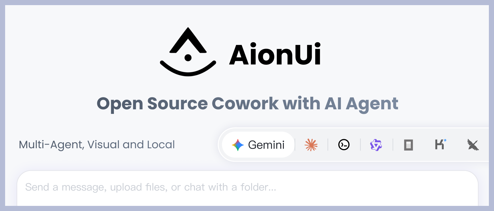
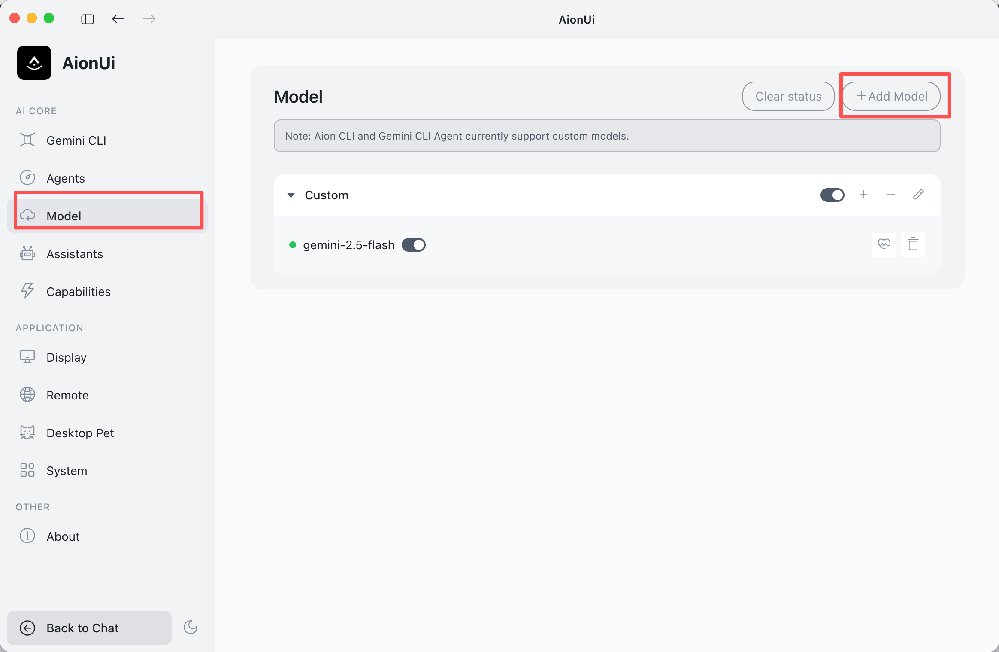
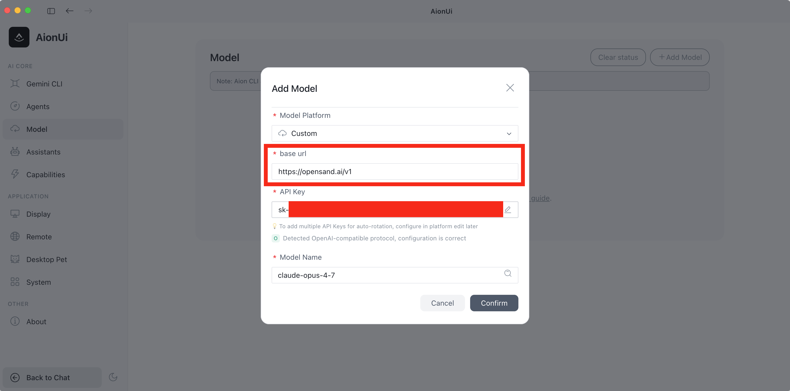

# AionUi

> This page uses OpenSand API endpoints, setup scripts, and console field names. Third-party client interfaces may change by version, so use your installed version as the source of truth.

🚀 AionUi is a free, local, open-source Cowork that supports multiple AI agents such as Gemini CLI, Claude Code, Codex, OpenCode, Qwen Code, Goose CLI, Auggie, and more. It provides a complete GUI interface and WebUI remote access functionality, serving as an open-source alternative to Cowork.

- Official Website: [https://www.aionui.com](https://www.aionui.com)
- GitHub Repository: [https://github.com/iOfficeAI/AionUi](https://github.com/iOfficeAI/AionUi)
- Download: [https://github.com/iOfficeAI/AionUi/releases](https://github.com/iOfficeAI/AionUi/releases)

## Core Features

### 💬 Multi-Session Chat
- **Multi-Session + Independent Context** - Open multiple chat sessions simultaneously, each session has independent context memory
- **Local Storage** - All conversation data is saved in a local SQLite database and will not be lost

### 🤖 Multi-Model Support
- **Multi-Platform Support** - Supports mainstream models like Gemini, OpenAI, Claude, Qwen, flexible switching
- **Local Model Support** - Supports local model deployment like Ollama, LM Studio

### 🤝 Multi-Agent Mode
- **Run Multiple AI Agents Simultaneously** - Can run multiple AI agents simultaneously (such as Gemini CLI, Claude Code, Codex, OpenCode, Qwen Code, Goose CLI, Auggie, etc.)
- **MCP Unified Management** - Unified management and configuration of all agents through Model Context Protocol (MCP), simplifying operations
- **Skills Configuration** - Support configuring dedicated Skills for different agents to extend agent capabilities
- **Assistant Customization** - Support custom assistant configuration to create personalized AI workflows
- **Independent Configuration** - Each agent can be configured and used independently without interference
- **Flexible Switching** - Flexibly switch between different agents to meet various scenario needs

### 🗂️ File Management
- **File Tree Browsing + Drag & Drop Upload** - Browse files like folders, support drag and drop files or folders for one-click import
- **Smart Organization** - Let AI help organize folders with automatic classification

### 📄 Preview Panel
- **9+ Format Preview** - Supports PDF, Word, Excel, PPT, code, Markdown, images, and other formats
- **Real-time Tracking + Editable** - Automatically tracks file changes, supports real-time editing and debugging of Markdown, code, HTML

### 🎨 AI Image Generation & Editing
- **Intelligent Image Generation** - Supports multiple image generation models like Gemini 2.5 Flash Image Preview, Nano, Banana
- **Image Recognition & Editing** - AI-driven image analysis and editing features

### 🌐 Multi-Channel Access
- **WebUI Remote Access** - Access from any device on the network via browser, supports mobile devices
- **Telegram Integration** - Support interaction through Telegram bot
- **Feishu Integration** - Support access and interaction through Feishu
- **Local Data Security** - All data stored in local SQLite database, suitable for server deployment

## OpenSand Integration Method

### Parameter Configuration

| Field | Value |
|---|---|
| Provider Type | OpenSand supported types |
| API Key | Obtained from OpenSand |
| API Address | OpenSand site address (e.g. `https://opensand.ai/v1`) |

### Configuration Steps

1. **Copy your API key in OpenSand**
   

2. **Open AionUi Settings**
   - Go to the settings page in AionUi
   - Find the Model Configuration tab
   - Click "Add Model"
   

3. **Add a New Provider**
   - Click "Add Model"
   - Select OpenSand
   

4. **Configure the API Information**
   - API Address: Fill in your OpenSand site address (format: `https://opensand.ai/v1`)
   - API Key: Paste the API Key copied from the OpenSand console

5. **Add Models**
   - Select the model to add from the dropdown
   - The model name should match the model name configured in OpenSand
   - Choose the appropriate request protocol

6. **Start Using**
   - Return to the chat page
   - Select the configured OpenSand model to start a conversation

## Related Links

- [GitHub Repository](https://github.com/iOfficeAI/AionUi)
- [Complete Usage Guide](https://github.com/iOfficeAI/AionUi#-detailed-usage-guide)
- [FAQ](https://github.com/iOfficeAI/AionUi#-support--help)
