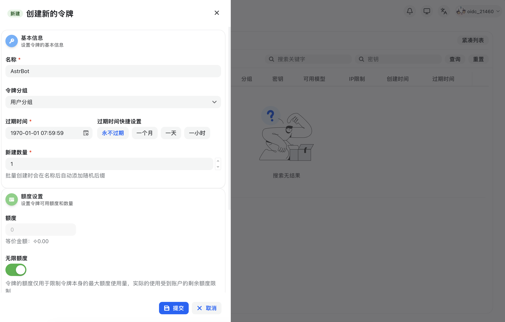
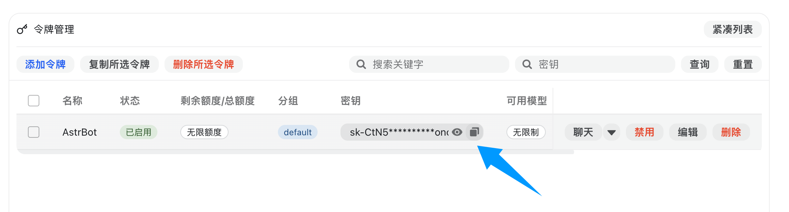
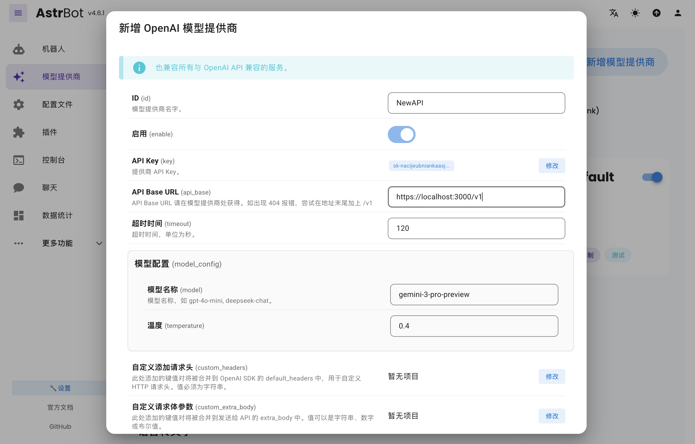
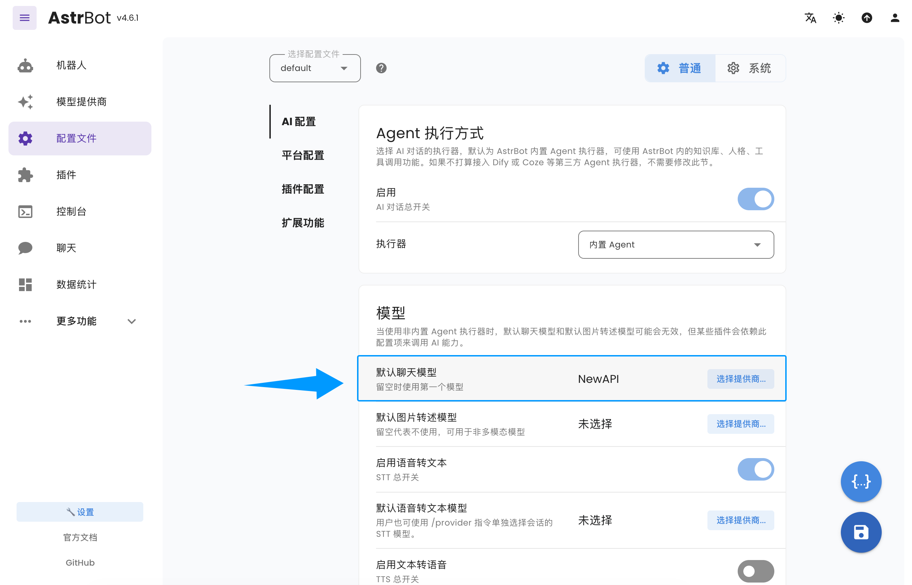

# AstrBot - Agent Chatbot

> This page uses OpenSand API endpoints, setup scripts, and console field names. Third-party client interfaces may change by version, so use your installed version as the source of truth.

AstrBot is an open-source, all-in-one Agent chatbot platform that seamlessly
integrates large model capabilities into mainstream instant messaging software
such as QQ, Feishu, DingTalk, and WeChat Work, building reliable and scalable
conversational AI infrastructure for individuals, developers, and teams.
Whether it's a personal AI companion, smart customer service, automation
assistant, or enterprise knowledge base, AstrBot can quickly build
production-ready AI applications within your instant messaging software
platform's workflow.

- Official Website: [https://astrbot.app](https://astrbot.app)
- Official Documentation: [https://docs.astrbot.app](https://docs.astrbot.app)
- Project Homepage: [https://github.com/astrbotdevs/astrbot](https://github.com/astrbotdevs/astrbot)

## OpenSand Integration Method

AstrBot supports integrating OpenSand as a model provider, allowing users to access and use various AI model services through OpenSand.

### Configuration Steps

#### Obtain OpenSand API Key

After registering and logging in to OpenSand, click 'Console' in the top navigation bar, click 'Token Management', then click the 'Add Token' button to create a new API Key, select appropriate permissions, and then click 'Create'.

After successful creation, click the 'Copy Key' button to copy the generated API Key.

#### Configure OpenSand Service Provider in AstrBot

Open the AstrBot management panel, go to the 'Model Providers' page, then click the 'Add Model Provider' button.

OpenSand perfectly supports OpenAI Chat Completion and Responses interfaces. We click 'OpenAI' to enter the OpenAI provider's configuration page.

In the pop-up dialog box, set the API Base URL to OpenSand's interface address. Use the OpenSand endpoint, for example `https://opensand.ai/v1`.

Then, enter the API Key into the 'API Key' field and click the 'Save' button.

Then click Save to complete the OpenSand provider configuration.

#### Apply Service Provider

Go to the 'Configuration File' page, find the 'Models' section, change 'Default Chat Model' to the OpenSand provider you just created, and click the 'Save' button.

At this point, you have successfully configured OpenSand as AstrBot's model provider. Now, you can access and use various AI model services provided by OpenSand through AstrBot.
