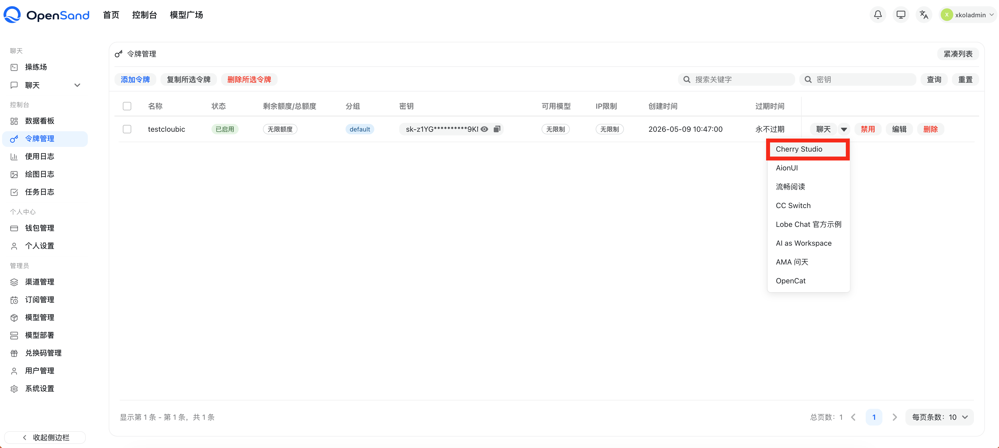
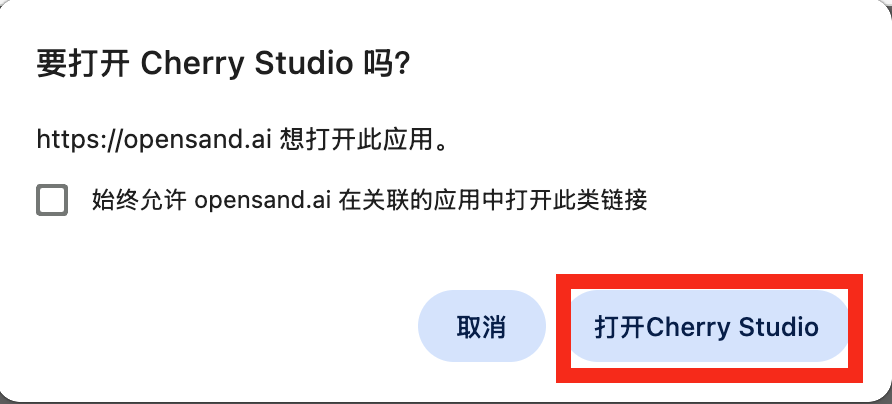
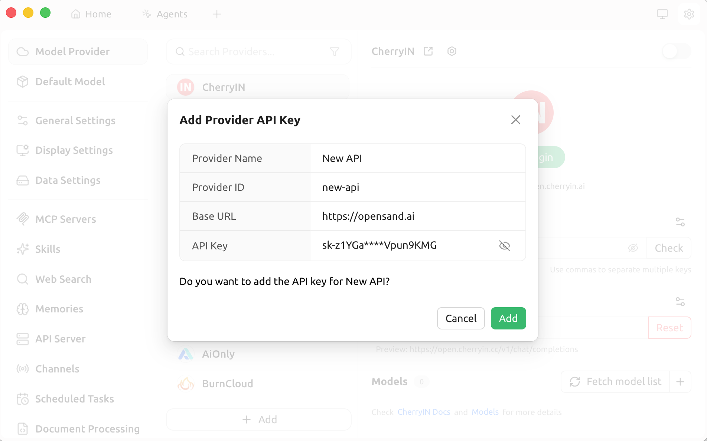
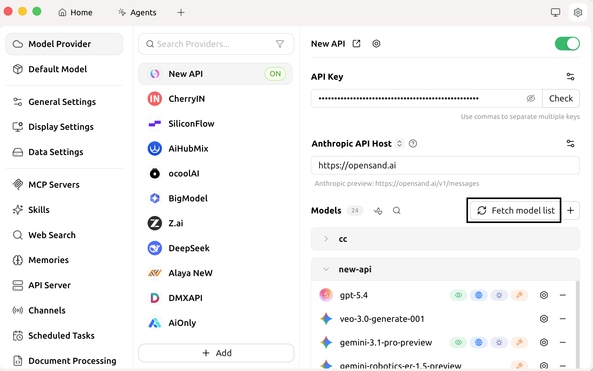
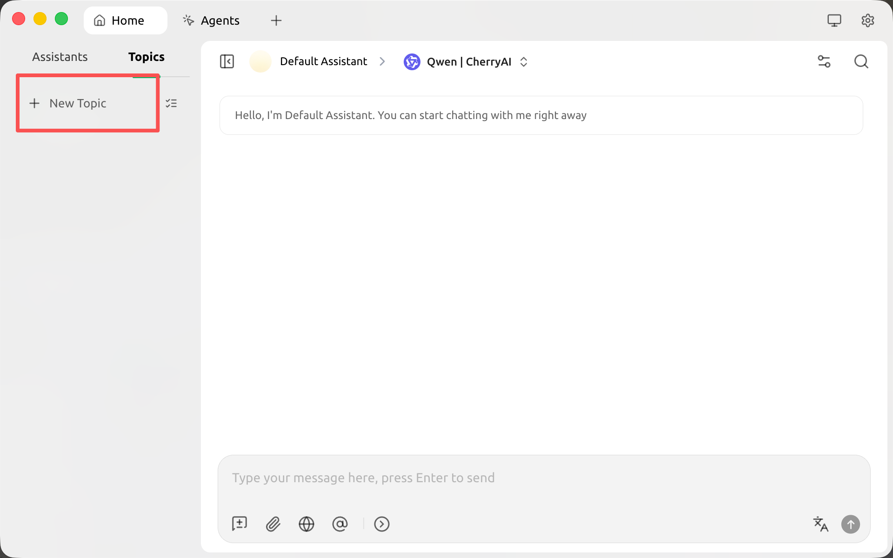
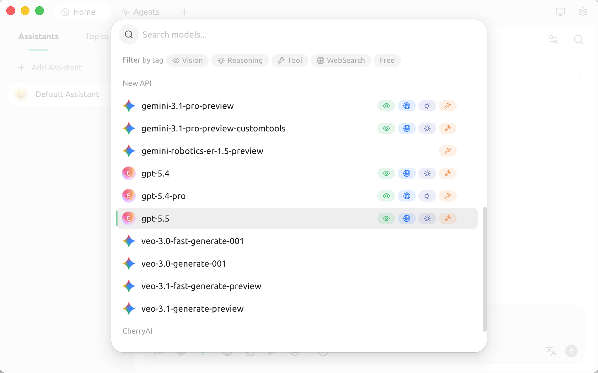

# Cherry Studio

> This page uses OpenSand API endpoints, setup scripts, and console field names. Third-party client interfaces may change by version, so use your installed version as the source of truth.


**Chat Settings Options**

In the System Settings -> Chat Settings of the OpenSand console, the following shortcut options can be added to easily populate Cherry Studio with a single click on the token management page:

    ```json
    { "Cherry Studio": "cherrystudio://providers/api-keys?v=1&data={cherryConfig}" }
    ```

🍒 Cherry Studio is a powerful desktop AI client designed for professional users, integrating 30+ industry-specific intelligent assistants to meet the needs of various work scenarios and significantly improve work efficiency.

- Official Website: [https://cherry-ai.com](https://cherry-ai.com/)
- Download: [https://cherry-ai.com/download](https://cherry-ai.com/download)
- Official Documentation: [https://docs.cherry-ai.com](https://docs.cherry-ai.com)

## OpenSand Integration Method

### Parameter Configuration

Provider Type: OpenSand supported types
API Key: Obtained from OpenSand
API Address: OpenSand site address

### Visual Guide

1. **Click the Cherry Studio one-click setup on the token management page**

   

2. **Click the pop-up dialog**

   

3. **Add Provider**

   

4. **Add Models**

   

5. **Return to the chat page**
   

6. **Switch to the OpenSand model**
   
