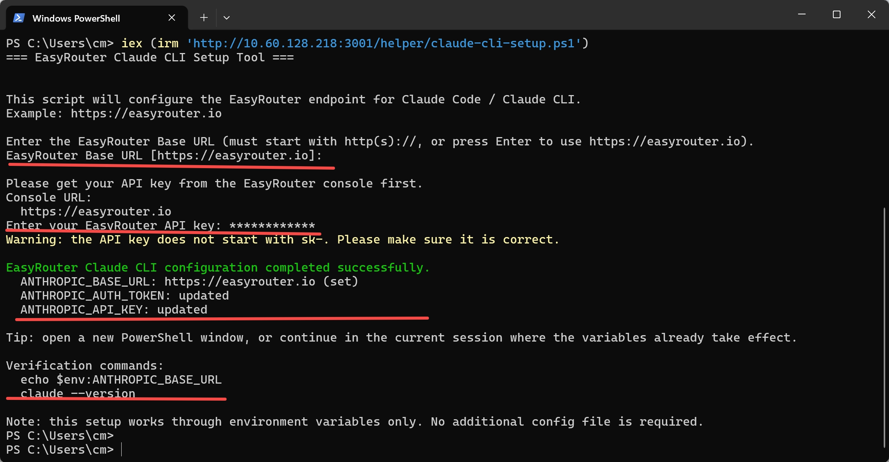
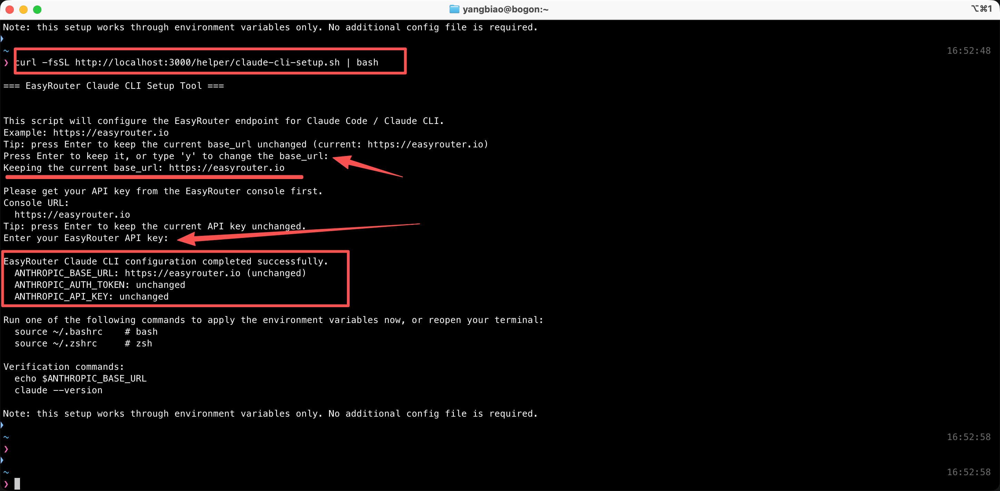

# Claude Code

> This page uses OpenSand API endpoints, setup scripts, and console field names. Third-party client interfaces may change by version, so use your installed version as the source of truth.


**Project Introduction**

Unleash Claude's raw power directly in your terminal. Search million-line codebases instantly. Turn hours-long workflows into a single command. Your tools. Your workflow. Your codebase, evolving at thought speed.

- Official Homepage: [https://www.anthropic.com/claude-code](https://www.anthropic.com/claude-code)

### Features

| **Category**                       | **Feature**                                                                                                        |
| ---------------------------------- | ------------------------------------------------------------------------------------------------------------------ |
| **Code Understanding**             | Deep codebase analysis, utilizing intelligent agents to search and understand project structure and dependencies |
|                                    | Automatically generates high-level code overviews, quickly helping users understand the codebase                 |
| **Code Editing**                   | Supports multi-file collaborative editing, suitable for complex code modifications                               |
|                                    | Provides practical and usable code suggestions that align with project patterns and architecture                 |
| **Integration Capabilities**       | Supports direct execution in the terminal, eliminating context switching                                         |
|                                    | Seamless integration with VS Code and JetBrains IDEs, no copy-pasting required                                   |
| **Code Generation & Optimization** | Automatically generates code, creates tests, fixes bugs, supporting the complete process from concept to commit  |
|                                    | Optimized for code generation and understanding, combining advanced models like Claude Opus 4                    |
| **Security & Flexibility**         | Changes require explicit user authorization, ensuring safer file and command operations                          |
|                                    | Adapts to user code standards, supports custom configurations                                                    |
| **Toolchain Integration**          | Supports integration with tools like GitHub and GitLab to achieve automated workflows                            |
|                                    | Integrates with test suites and build systems, enhancing existing development tools                              |
| **Cross-Platform & Extensibility** | Supports Windows, macOS, and Linux operating systems                                                             |
|                                    | Configurable to run in SDKs or GitHub Actions, flexibly adapting to different needs                              |
| **Key Application Scenarios**      | Codebase onboarding and understanding, quick ramp-up for new members                                             |
|                                    | Code issue fixing and optimization processes, from problem analysis to PR submission                             |
|                                    | Project code refactoring and new feature implementation                                                          |
| **User Feedback Highlights**       | Improves daily development efficiency, saving time spent on routine tasks                                        |
|                                    | Excellent performance in handling complex multi-step tasks, expanding development possibilities                  |

## AI Model Configuration Method

### Windows Graphical Guide

#### 1. Install Node.js Environment

Claude Code requires a Node.js environment to run.

**Node.js Environment Installation Steps**

- Open your browser and visit https://nodejs.org/
- Click the "LTS" version to download (Long Term Support version recommended)
- After downloading, double-click the .msi file
- Follow the installation wizard to complete the installation, keeping default settings

**Windows Notes**

- It is recommended to use PowerShell instead of CMD
- If you encounter permission issues, try running as administrator
- Some antivirus software may report false positives; you may need to add an exception


**Verify Installation Success**

After installation, open PowerShell or CMD and enter the following commands:

```bash
node --version
npm --version
```

If version numbers are displayed, the installation was successful.

#### 2. Install Git Bash

**Windows Notes**

In a Windows environment, Git Bash is required to install Claude Code. After installation, environment variable setup and using Claude Code will still be done in regular PowerShell or CMD.

**Download and Install Git for Windows**

- Visit https://git-scm.com/downloads/win
- Click "Download for Windows" to download the installer
- Run the downloaded .exe installation file
- Keep default settings during installation, and click "Next" to complete the installation


**Verify Git Bash Installation**

After installation, open Git Bash and enter the following command to verify:

```bash
git --version
```

If a version number is displayed, the installation was successful.

#### 3. Install Claude Code

**Install Claude Code**

Open PowerShell and run the following command:

```bash
npm install -g @anthropic-ai/claude-code
```

This command will download and install the latest version of Claude Code from the official npm repository.


**Add ~/.local/bin to PATH (only if prompted)**

```powershell
[Environment]::SetEnvironmentVariable('Path', ([Environment]::GetEnvironmentVariable('Path','User') + ";$HOME\.local\bin"), 'User')
```

**Verify Claude Code Installation**

After installation, enter the following command to check if it was successfully installed:

```bash
claude --version
```

If a version number is displayed, congratulations! Claude Code has been successfully installed.

#### 4. Set Environment Variables

**One-Click Setup Command (Windows System)**

To allow Claude Code to connect to your relay service, you need to set multiple environment variables:

```powershell
iex (irm 'https://opensand.ai/scripts/claude-cli-setup.ps1')
```



#### 5. Start Using Claude Code

You can now start using Claude Code!

**Launch Claude Code**

Open PowerShell and launch Claude Code directly:

```bash
claude
```

To use in a specific project:

```bash
# Navigate to your project directory
cd C:\path\to\your\project

# Launch Claude Code
claude
```


**Select Model**

Enter the command:

```bash
/model
```

Press Enter to select a model; usually, the default settings are sufficient.


> Note: After modifying environment variables, all models (including officially preset models) will call the custom access point instead of using official account quotas.

### macOS Graphical Guide

#### 1. Install Claude Code CLI

Open Terminal.app

**Install Claude Code**

Open Terminal and run the following command:

```bash
curl -fsSL https://claude.ai/install.sh | bash
```

Optional: Run the provided command when prompted

```bash
echo 'export PATH="$HOME/.local/bin:$PATH"' >> ~/.bashrc && source ~/.bashrc
```


#### 2. Set Environment Variables

To allow Claude Code to connect to OpenSand, set these environment variables:

**One-Click Setup for Claude Code Environment Variables**

Enter the command:

```bash
curl -fsSL https://opensand.ai/scripts/claude-cli-setup.sh | bash
```



**Verify Claude Code Installation**

After installation, enter the following command to check if it was successfully installed:

```bash
claude --version
```

If a version number is displayed, congratulations! Claude Code has been successfully installed.

#### 3. Start Using Claude Code

You can now start using Claude Code!

**Launch Claude Code**

Launch Claude Code directly:

```bash
claude
```

To use in a specific project:

```bash
# Navigate to your project directory
cd /path/to/your/project

# Launch Claude Code
claude
```


**Select Model (Optional)**

Enter the command:

```bash
/model
```

Press Enter to select an official model; usually, the default model is sufficient.

> Note: After modifying the `ANTHROPIC_BASE_URL` environment variable, all models (including officially preset models) will call the custom access point instead of using official account quotas.

#### 4. macOS Common Issues

**macOS Security Settings Preventing Execution**

If the system prevents Claude Code from running:

- Open "System Preferences" → "Security & Privacy"
- Click "Open Anyway" or "Allow"
- Or run in Terminal: `sudo spctl --master-disable`

### Linux Graphical Guide

#### 1. Install Claude Code


**Install Claude Code**

Open Terminal and run the following command:

```bash
curl -fsSL https://claude.ai/install.sh | bash
```

If you encounter permission issues, you can use sudo:

```bash
sudo curl -fsSL https://claude.ai/install.sh | bash
```

**Verify Claude Code Installation**

After installation, enter the following command to check if it was successfully installed:

```bash
claude --version
```

If a version number is displayed, congratulations! Claude Code has been successfully installed.

#### 2. Set Environment Variables

To allow Claude Code to connect to your relay service, you need to set two environment variables:

**One-Click Environment Variable Modification**

Enter the command:

```bash
curl -fsSL https://opensand.ai/scripts/claude-cli-setup.sh | bash
```


#### 3. Start Using Claude Code

You can now start using Claude Code!

**Launch Claude Code**

Launch Claude Code directly:

```bash
claude
```

To use in a specific project:

```bash
# Navigate to your project directory
cd /path/to/your/project

# Launch Claude Code
claude
```


**Select Model**

Enter the command:

```bash
/model
```

Press Enter to select an official model; usually, the default model is sufficient.

> Note: After modifying the `ANTHROPIC_BASE_URL` environment variable, all models (including officially preset models) will call the custom access point instead of using official account quotas.

#### 4. Linux Common Issues

**Missing Dependency Libraries**

Some Linux distributions require additional dependencies to be installed:

```bash
# Ubuntu/Debian
sudo apt install build-essential

# CentOS/RHEL
sudo dnf groupinstall "Development Tools"
```

**Environment Variables Not Taking Effect**

Check the following points:

- Confirm that you modified the correct configuration file (`.bashrc` or `.zshrc`)
- Restart the terminal or run `source ~/.bashrc`
- Verify settings: `echo $ANTHROPIC_BASE_URL`
