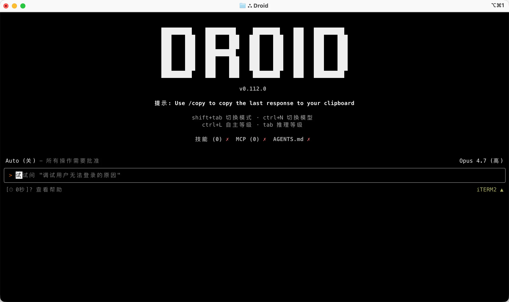
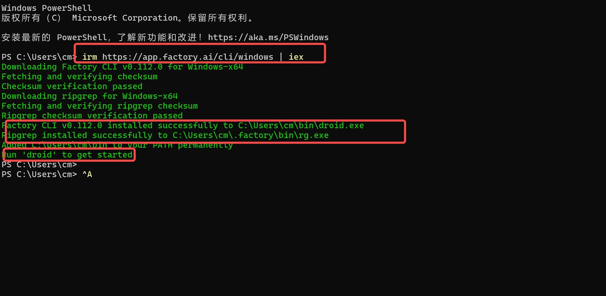
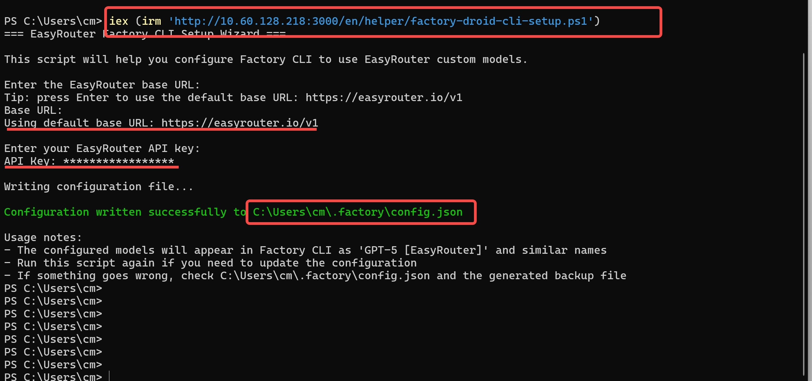
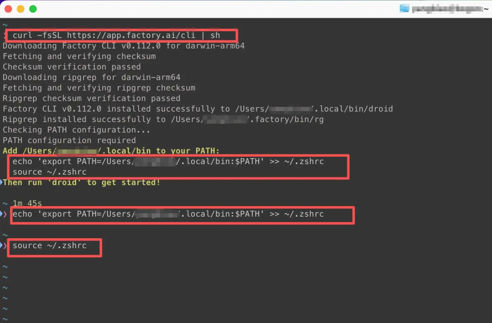
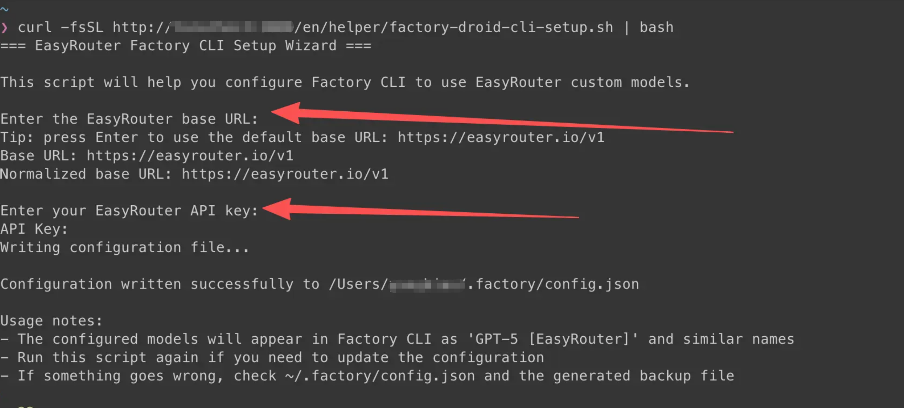

# Factory Droid CLI

> This page uses OpenSand API endpoints, setup scripts, and console field names. Third-party client interfaces may change by version, so use your installed version as the source of truth.


**Project Introduction**

Droid CLI is a command-line tool developed by Factory AI, designed to run as an AI software engineering agent. It allows users to interact with various large language models through the terminal, build, debug, and refactor code, and even create complete applications.

- Official Homepage: [https://factory.ai/product/cli](https://factory.ai/product/cli)
- Official Documentation: [https://docs.factory.ai/cli/getting-started/quickstart](https://docs.factory.ai/cli/getting-started/quickstart)

## Demo



### Features

| Category                       | Feature                                                                                                                     | Value/Capability                                               | Example/Notes                                                             |
| ------------------------------ | --------------------------------------------------------------------------------------------------------------------------- | -------------------------------------------------------------- | ------------------------------------------------------------------------- |
| Quick Start with CLI           | 30-second installation; launch droid interactive session in project directory; supports macOS/Linux and Windows             | Rapid integration into current projects, no new tools required | Windows Installation: `irm https://app.factory.ai/cli/windows \| iex`; Launch: `droid` |
| End-to-End Feature Development | Full-process automation from planning to implementation to testing; transparent review process                              | Accelerate delivery, maintain human oversight                  | Native diff viewing and approval process (see "Transparency and Control") |
| Deep Codebase Understanding    | Integrates organizational shared knowledge from codebases, documentation, issue tracking; context-aware, improves over time | More accurate suggestions and changes                          | Continuously leverages knowledge across repositories and documents        |
| Engineering System Integration | Native integration with Jira, Notion, Slack, and other tools; development work stays synchronized with team processes       | Reduce tool switching and information silos                    | "etc." indicates more integrations                                        |
| Production-Grade Automation    | Workflows reusable locally and in CI/CD; enterprise-grade security and compliance built-in                                  | Consistency and auditability                                   | Adapts to pipelines and enterprise environments                           |
| Enterprise Capabilities        | Private deployment options, SOC-2 compliance, air-gapped environments                                                       | Meets security and compliance requirements                     | Prioritizes security and quality                                          |
| Enhance Existing Tools         | Works in terminal, IDE, and existing development environments; no need to switch editors or learn new interfaces            | Maintain existing work habits, low migration cost              | Deep integration with familiar tools                                      |
| Transparency and Control       | Every decision is visible and reviewable; complete oversight of code changes; native diff viewing and approval workflows    | Reduce risk, enhance controllability                           | Audit-friendly, traceable                                                 |
| Model Flexibility              | Not locked to a single AI provider; choose the best model per task; consistent organizational behavior and memory           | Optimal choice between performance and cost                    | Supports multi-model routing                                              |
| Next Steps & Resources         | Quickstart, Common Use Cases, IDE Integration, Configuration, AGENTS.md                                                     | Facilitates adoption and practice                              | See "Next steps/Additional resources" on the page                         |

## AI Model Configuration Method

### Windows Graphical Guide

#### 1. Open Terminal && Install Factory Droid CLI

Official one-click installation command:

**One-click Installation Command**

```powershell
irm https://app.factory.ai/cli/windows | iex
```



#### 2. Modify Configuration File

Droid CLI requires modifying the configuration file to use OpenSand.



**Modify Environment Variables**

```powershell
iex (irm 'https://opensand.ai/scripts/factory-droid-cli-setup.ps1')
```

#### 3. Start Using Droid CLI

Now you can start using Droid CLI!

**Launch Droid CLI**

Launch Droid CLI directly:

```bash
droid
```

Use in a specific project:

```bash
# Navigate to your project directory
cd C:\path\to\your\project

# Launch Droid CLI
droid
```

Press Enter to launch Droid CLI.

Droid CLI requires users to log in to an official account (free) before use.

#### 4. Windows Common Issues Solution

This is usually a permission issue. Try the following solutions:

- Run PowerShell as an administrator
- Or configure `npm` to use the user directory: `npm config set prefix %APPDATA%\npm`

**PowerShell Execution Policy Error**

If you encounter an execution policy restriction, run:

```powershell
Set-ExecutionPolicy -ExecutionPolicy RemoteSigned -Scope CurrentUser
```

### macOS/Linux Graphical Guide

#### 1. Install Droid CLI

**Install Droid CLI**

Open your terminal and run the following command:

```bash
curl -fsSL https://app.factory.ai/cli | sh
```



Follow the installation prompts to modify environment variables (copy the installation prompt code directly):

For Linux, choose `~/.bashrc` or `~/.zshrc` as appropriate.

**Droid CLI Environment Variables (Example Only)**

```bash
echo 'export PATH=/Users/modify_here/.local/bin:$PATH' >> ~/.zshrc
source ~/.zshrc
```

#### 2. Modify Configuration File

Droid CLI requires modifying the configuration file to use OpenSand.

**One-click Configuration File Modification**

```bash
curl -fsSL https://opensand.ai/scripts/factory-droid-cli-setup.sh | bash
```



#### 3. Start Using Droid CLI

Now you can start using Droid CLI!

**Launch Droid CLI**

Launch Droid CLI directly:

```bash
droid
```

Use in a specific project:

```bash
# Navigate to your project directory
cd /path/to/your/project

# Launch Droid CLI
droid
```

Press Enter to launch Droid CLI.

> Droid CLI requires users to log in to an official account (free) before use.
