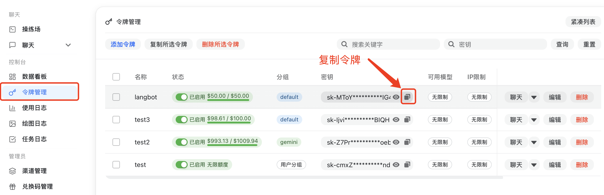
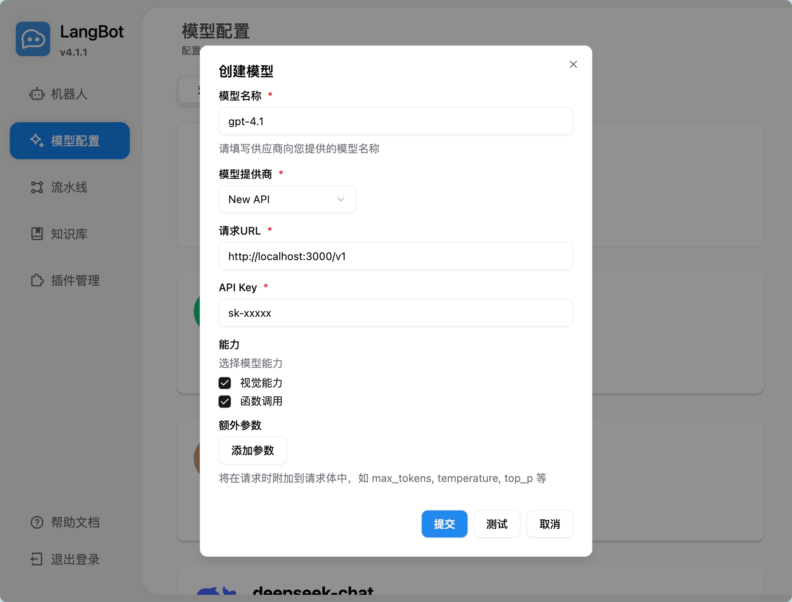
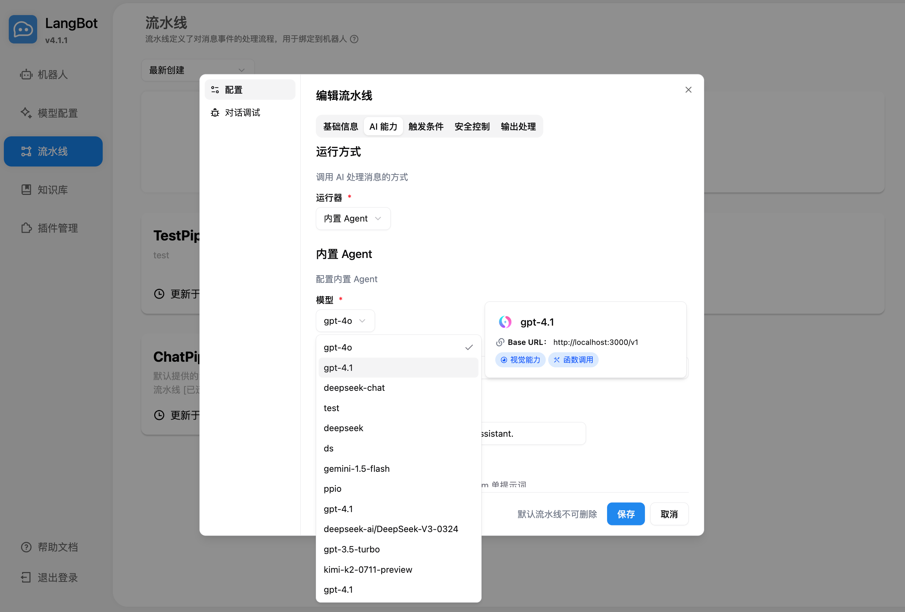
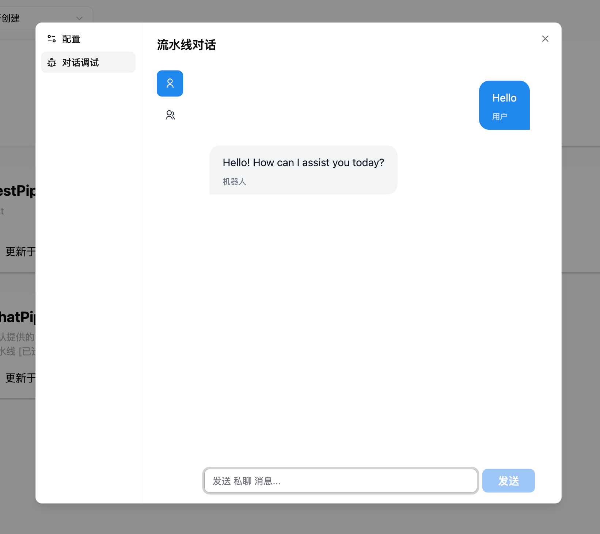
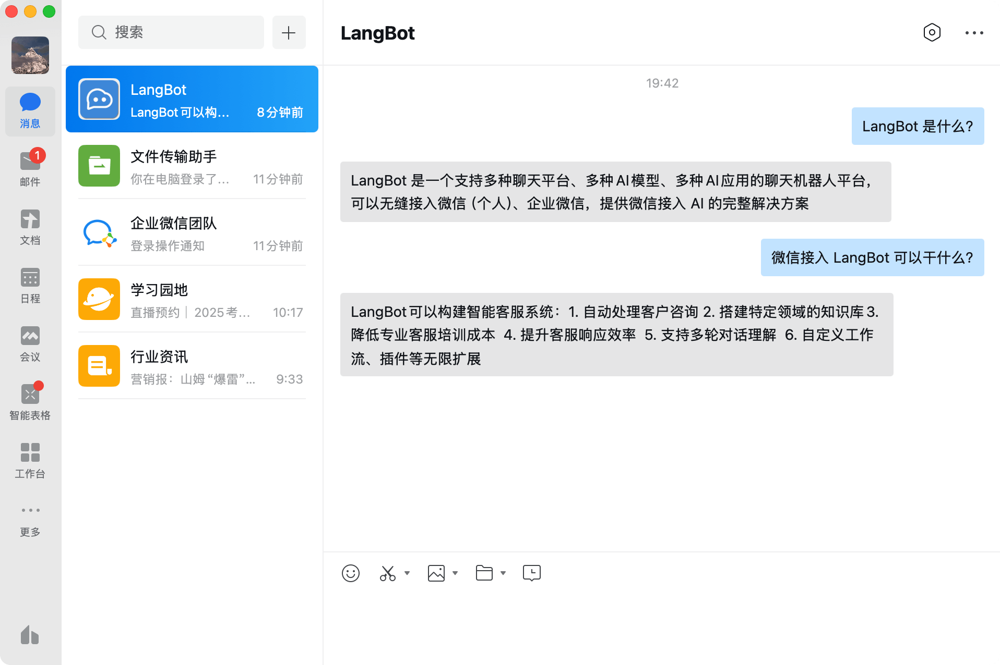
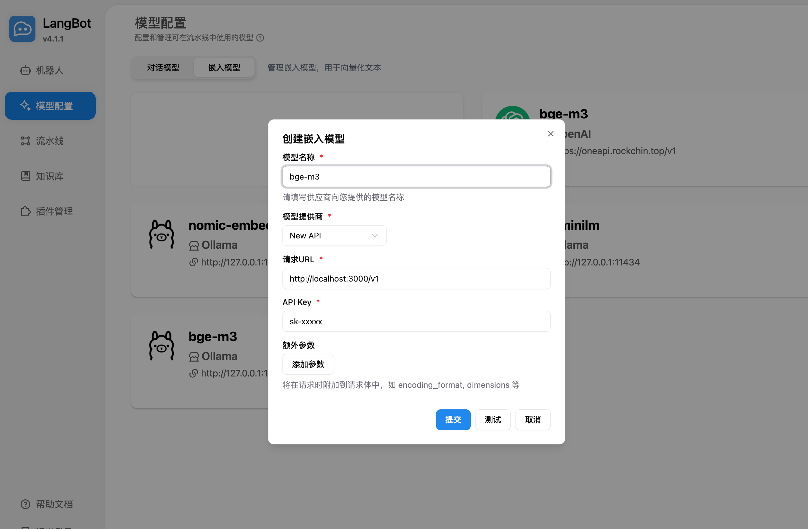
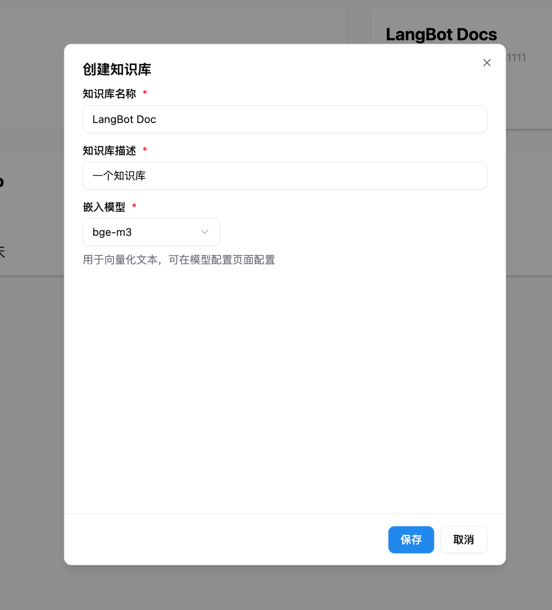

# LangBot - Instant Messaging Bot Development Platform

> This page uses OpenSand API endpoints, setup scripts, and console field names. Third-party client interfaces may change by version, so use your installed version as the source of truth.

LangBot is an open-source instant messaging bot development platform that
supports various instant messaging platforms such as Feishu, DingTalk, WeChat,
QQ, Telegram, Discord, Slack, etc. It integrates with mainstream global AI
models, supports various AI application capabilities like Knowledge Base,
Agent, MCP, and is perfectly compatible with OpenSand.

- Official Website: [https://langbot.app](https://langbot.app/)
- Download Address: [https://github.com/langbot-app/LangBot/releases](https://github.com/langbot-app/LangBot/releases)
- Official Documentation: [https://docs.langbot.app](https://docs.langbot.app/)
- Open Source Address: [https://github.com/langbot-app/LangBot](https://github.com/langbot-app/LangBot)

## Integrating OpenSand

LangBot can connect to OpenSand through its OpenAI-compatible integration.

### Usage

1.  Obtain an API key from OpenSand
    

        For OpenSand, use `https://opensand.ai/v1`; the address should include `/v1`.

2.  Add a model in LangBot, select OpenSand as the provider, and fill in the corresponding API key and API address
    

3.  Select the model to use in the pipeline

    

4.  Use it by chatting in conversation debugging or by chatting with a bot bound to the pipeline

    

    

    For deploying and configuring bots, please refer to [Deploying Bots](https://docs.langbot.app/en/deploy/platforms/readme.html).

### Using LangBot Knowledge Base

LangBot supports using OpenSand's embedding models and utilizing them as vector models for the knowledge base.

1. Add an embedding model in LangBot, select OpenSand as the provider
   

2. Select the embedding model when creating a new knowledge base
   

For more usage instructions, please refer to the LangBot official documentation: [https://docs.langbot.app](https://docs.langbot.app/)
