# LunaTranslator - Open-source GalGame Translator

> This page uses OpenSand API endpoints, setup scripts, and console field names. Third-party client interfaces may change by version, so use your installed version as the source of truth.


**Chat Settings Options**

In the OpenSand console's System Settings -> Chat Settings, you can add the
following shortcut option for one-click population into LunaTranslator on the
Token Management page:

    ```json
    { "LunaTranslator": "lunatranslator://llmapi/base64?data={cheryConfig}" }
    ```

LunaTranslator is an open-source and free visual novel (GalGame) translator,
dedicated to providing a native-level visual novel gaming experience.

- Project Address: [https://github.com/HIllya51/LunaTranslator](https://github.com/HIllya51/LunaTranslator)
- Project Documentation: [https://docs.lunatranslator.org](https://docs.lunatranslator.org/en/README.html)

## Feature Support

- **HOOK** Primarily uses HOOK to extract game text, adapting to almost all common and niche visual novels.

- **In-game Translation** Some games can also have translations directly embedded in-game for an immersive experience.

- **HOOK Emulator** For most games on NS/PSP/PSV/PS2, HOOK emulator is supported to directly read game text.

- **OCR** Built-in high-precision OCR models, and supports many other online & offline OCR engines for flexible reading of any text.

- **Rich Translation Interfaces** Supports almost all translation engines, including large language model translation, offline translation, etc.

- **Language Learning** Supports Japanese word segmentation and kana furigana, AnkiConnect, and Yomitan plugin.

- **Speech Synthesis** Supports a large number of online & offline speech synthesis engines.

- **Speech Recognition** On Windows 10 and Windows 11, Windows Speech Recognition can be used.

## Installation

Download and install from [LunaTranslator Documentation - Download & Launch & Update](https://docs.lunatranslator.org/en/README.html)

## Integrating OpenSand into LunaTranslator

LunaTranslator can connect to OpenSand through its custom LLM API settings.

### One-Click Configuration

1.  In the OpenSand console's `System Settings` -> `Chat Settings`, add the following shortcut option:

    ```json
    { "LunaTranslator": "lunatranslator://llmapi/base64?data={cheryConfig}" }
    ```

    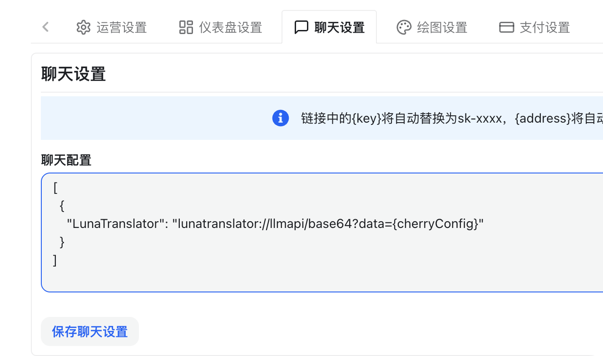

2.  In the **`OpenSand`** -> `Console` -> `Token Management` tab, select the token to be used in LunaTranslator, click the dropdown option next to the chat button, select `LunaTranslator`, and it will jump to LunaTranslator and automatically configure the API address and API Key.

    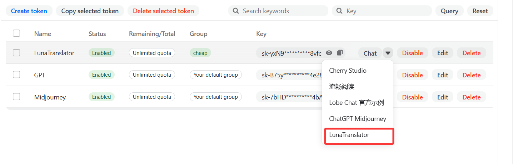

3.  In **`LunaTranslator`** -> `Settings` -> `Translation Settings` -> `Large Models`, a new large model interface configuration will appear; click Edit.

    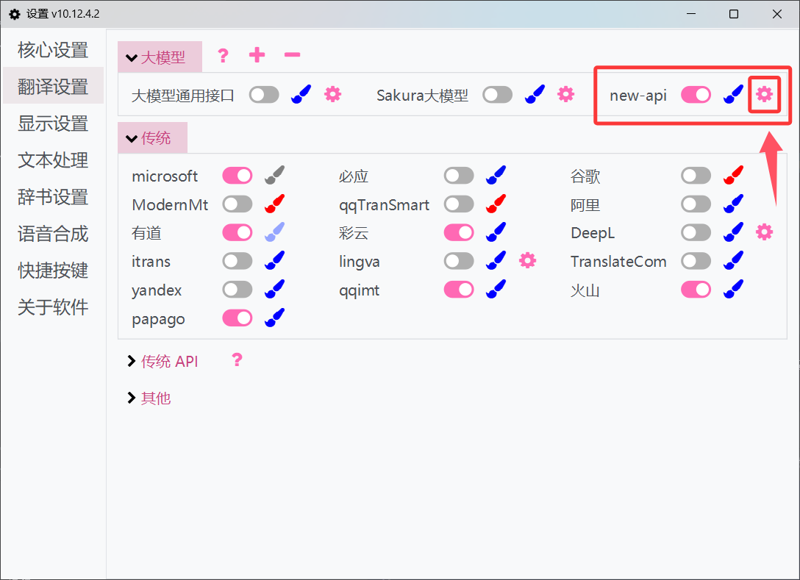

4.  Click the refresh button next to the **model** dropdown box to get the OpenSand platform's model list, select or enter the model name, then click OK to save.

    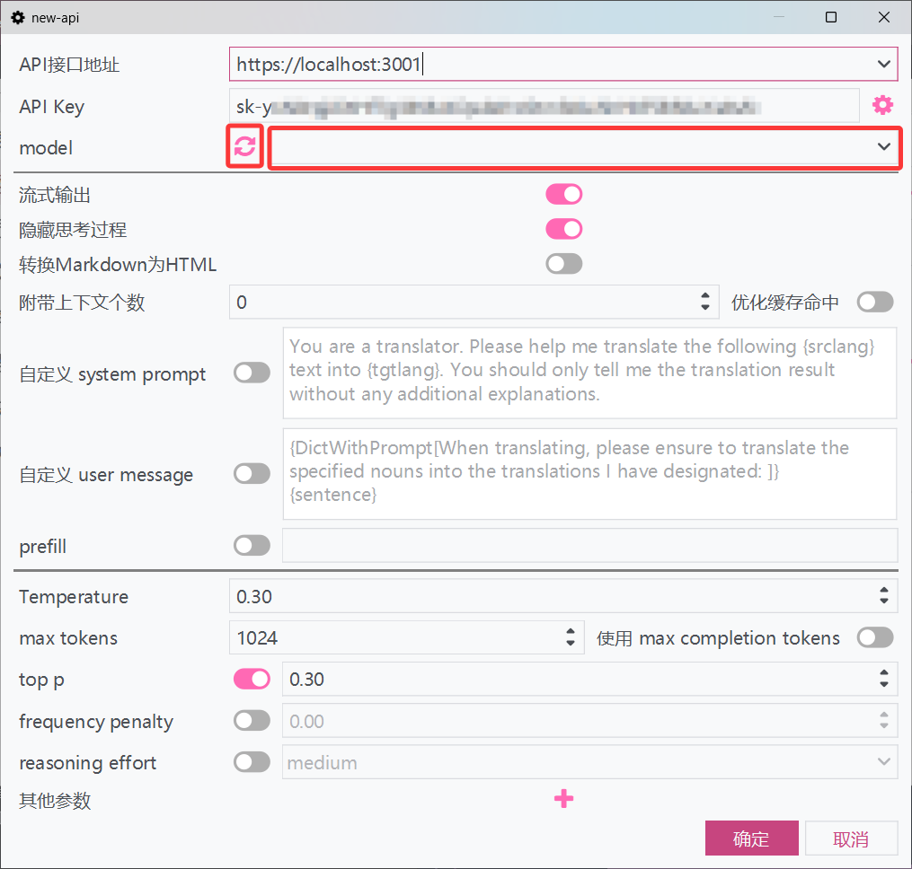

5.  Check if the toggle button next to the **new_api** large model interface configuration is open; if not enabled, enable the interface to start using it.

    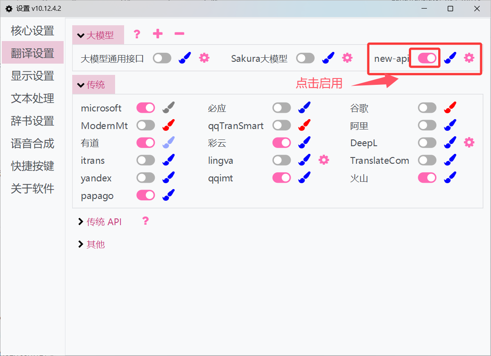

### Manual Configuration

1.  In the **`OpenSand`** -> `Console` -> `Token Management` tab, obtain the API Key.

    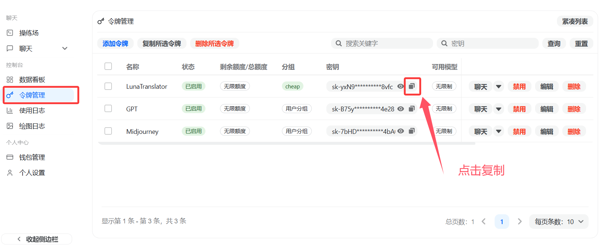

2.  In **`LunaTranslator`** -> `Settings` - `Translation Settings` -> `Large Models`, select Add.

    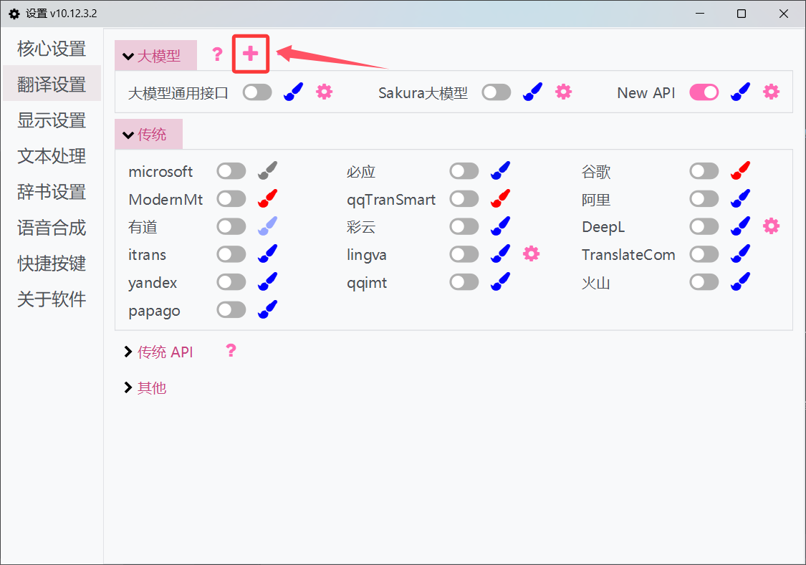

3.  Copy the **Large Model General Interface** template and add a new interface.

    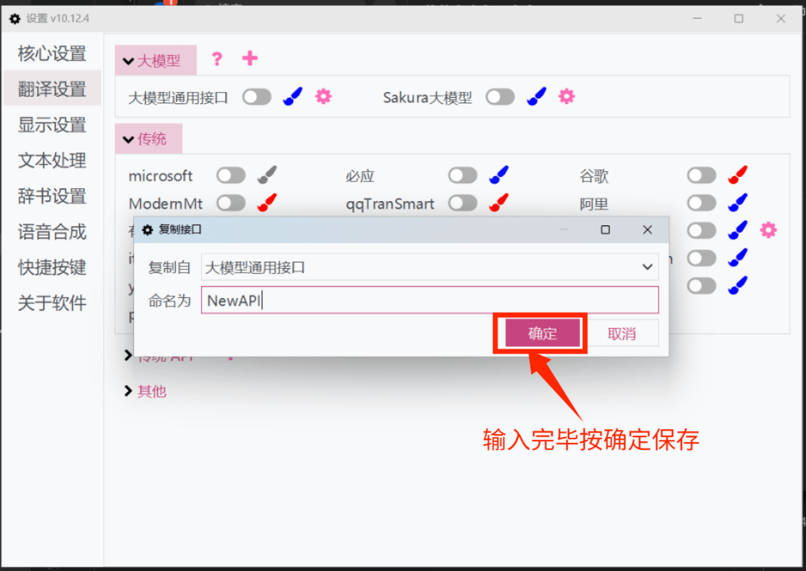

4.  In the **newly added interface**, fill in the corresponding API address and API Key.

    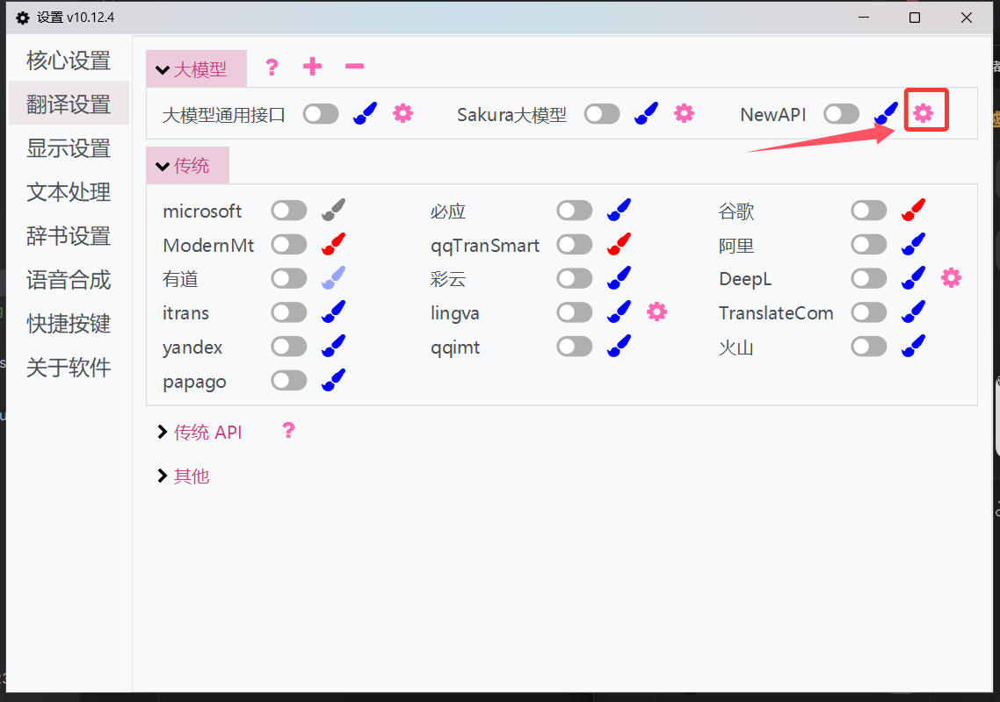

    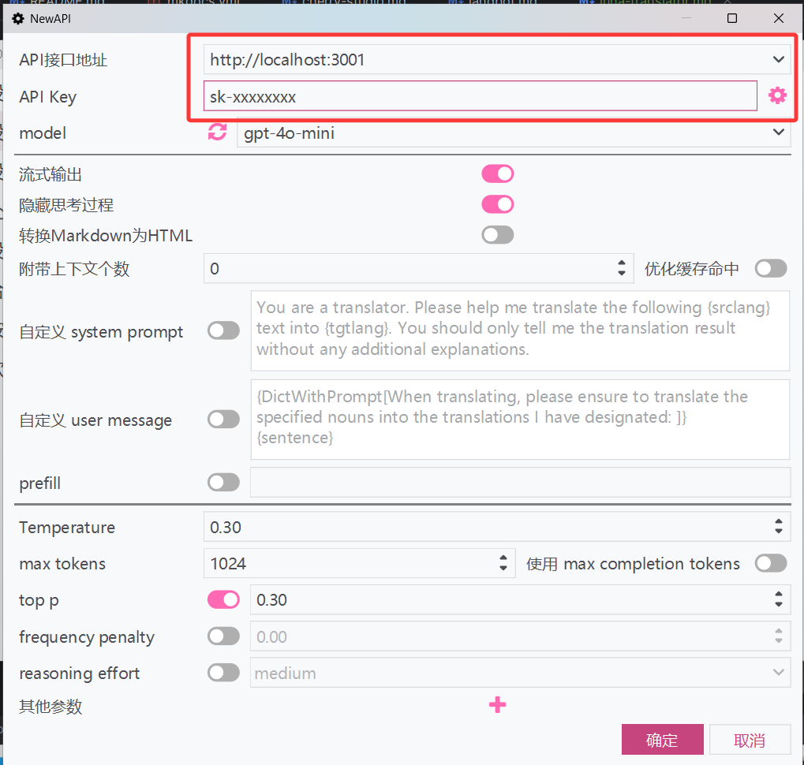

5.  Click the refresh button next to the **model** dropdown box to get the OpenSand platform's model list, select or enter the model name, then click OK to save.

    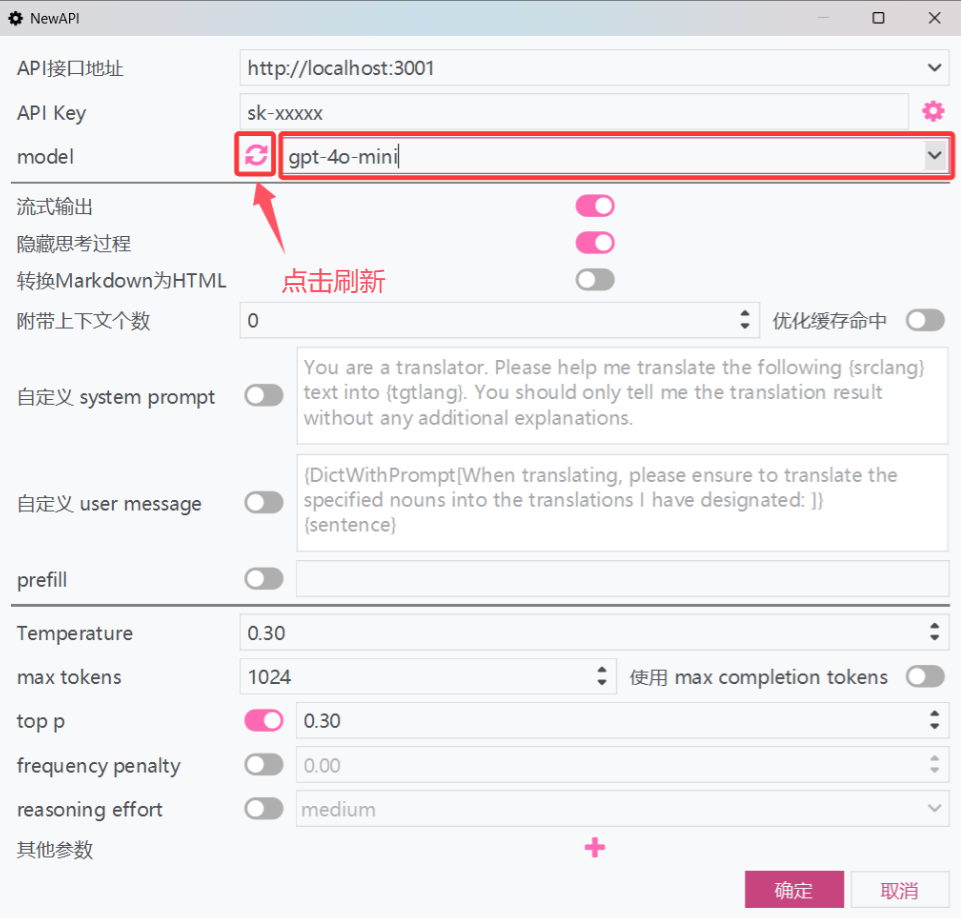

6.  Click the toggle button next to **OpenSand** to enable the interface and start using it.

    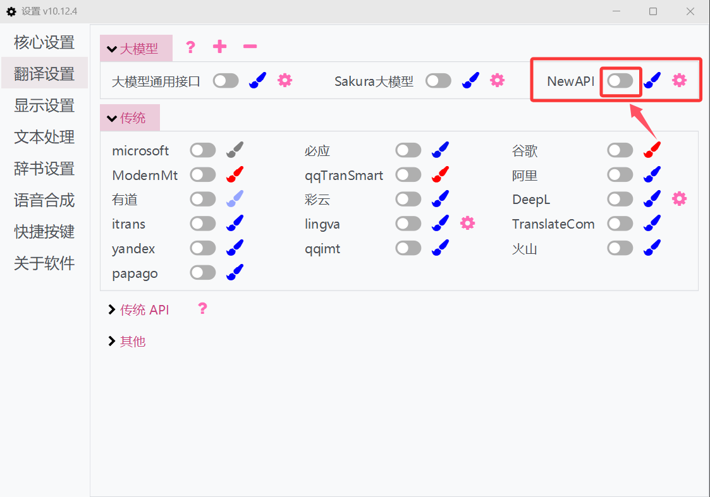

For more usage methods, please refer to the LunaTranslator official documentation: [LunaTranslator Documentation - Large Model Translation Interface](https://docs.lunatranslator.org/en/guochandamoxing.html)
