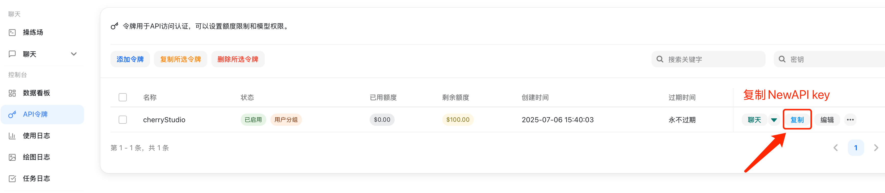
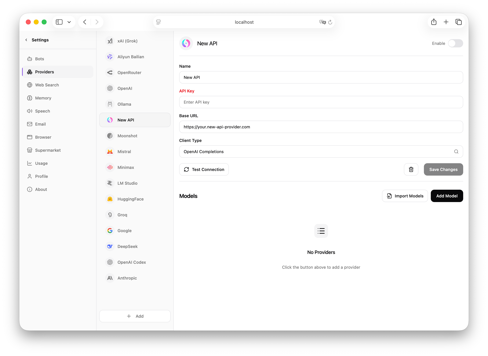
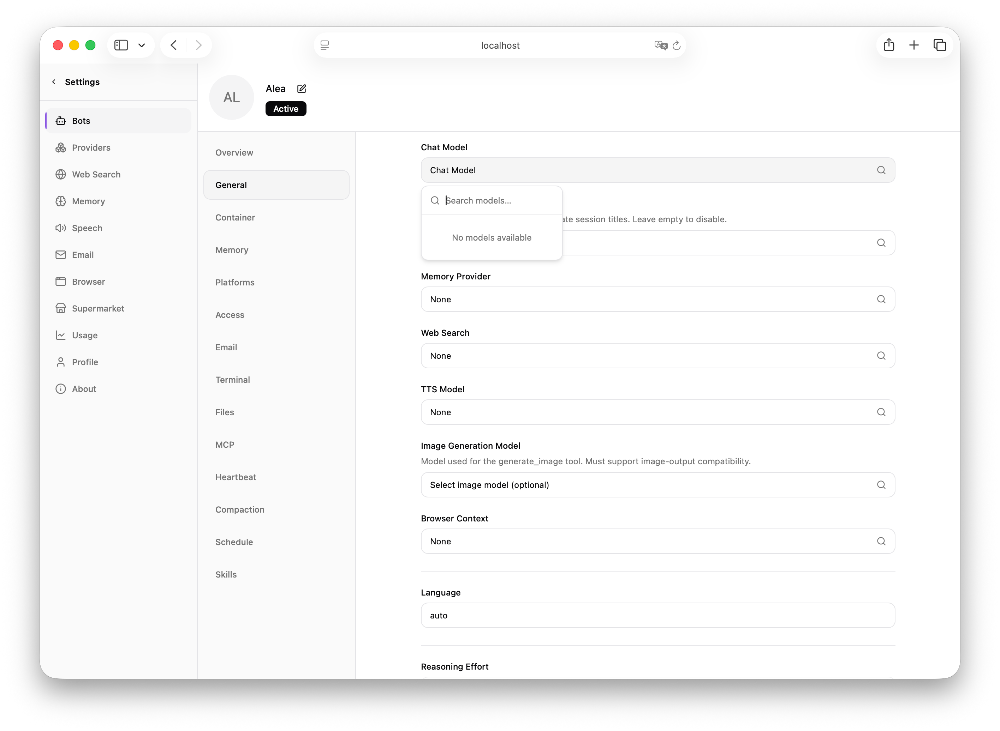

# Memoh - Containerized AI Agent Platform

> This page uses OpenSand API endpoints, setup scripts, and console field names. Third-party client interfaces may change by version, so use your installed version as the source of truth.


Memoh is an open-source, self-hosted AI agent platform where each bot runs in
its own isolated container with persistent memory and a dedicated filesystem.
It supports 9 channels including Telegram, Discord, Lark (Feishu), QQ, Matrix,
WeCom, WeChat, Email, and a built-in Web UI, along with MCP tool calling,
browser automation, scheduled tasks, and other rich agent capabilities.

- Website: [https://memoh.sh](https://memoh.sh)
- Documentation: [https://docs.memoh.ai](https://docs.memoh.ai)
- GitHub: [https://github.com/memohai/Memoh](https://github.com/memohai/Memoh)

## Key Features

- **Containerized Isolation**: Each bot runs in its own containerd container with a dedicated filesystem and network, supporting snapshots and data import/export
- **Memory Engine**: LLM-driven fact extraction, hybrid retrieval (dense + sparse + BM25), 24-hour context loading, memory compaction and rebuild
- **Multi-Channel Support**: Telegram, Discord, Lark (Feishu), QQ, Matrix, WeCom, WeChat, Email, Web UI
- **MCP Support**: Full MCP protocol support (HTTP / SSE / Stdio / OAuth), with independent MCP connection management per bot
- **Browser Automation**: Built-in headless browser powered by Playwright, supporting web browsing, form filling, screenshots, and more
- **Web Dashboard**: Modern management interface built with Vue 3 + Tailwind CSS, featuring streaming chat, tool call visualization, file management, and more

## Quick Installation

Memoh is deployed via Docker. One-click install (requires Docker):

```bash
curl -fsSL https://memoh.sh | sudo sh
```

Or install manually:

```bash
git clone --depth 1 https://github.com/memohai/Memoh.git
cd Memoh
cp conf/app.docker.toml config.toml
# Edit the config.toml configuration file
sudo docker compose up -d
```

After startup, visit `http://localhost:8082`. Default credentials: `admin` / `admin123`.

## OpenSand Integration

Memoh supports OpenAI-compatible model providers. In this guide, use Memoh's NewAPI/OpenAI-compatible provider type and point it to OpenSand.

### Configuration Steps

#### Obtain an OpenSand API Key

Sign in to the OpenSand console, open token management, create a new API key, and store it safely.

Once created, click the copy button to copy the generated API Key.



#### Add a Model Provider in Memoh

Log in to the Memoh Web dashboard, go to provider management, and choose NewAPI or an OpenAI-compatible provider.



Fill in the following information on the configuration page:

- **API Base URL**: Enter the OpenSand endpoint URL, e.g. `https://opensand.ai/v1` 
- **API Key**: Paste the API key created in the OpenSand console

Click Save to complete the provider configuration.

#### Import Models

After configuring the provider, go to the model management page and click auto-import or manually add the models you need.

#### Configure a Model for Your Bot

Go to the bot settings page, find the model configuration section, switch the default chat model to the one added via the NewAPI provider, and click Save.



You have now configured OpenSand as the model provider for Memoh. You can chat with AI bots through Memoh channels such as Telegram, Discord, and Lark, and requests will be routed through OpenSand.
