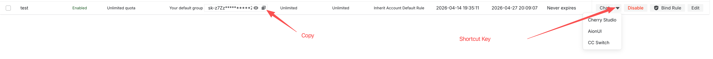
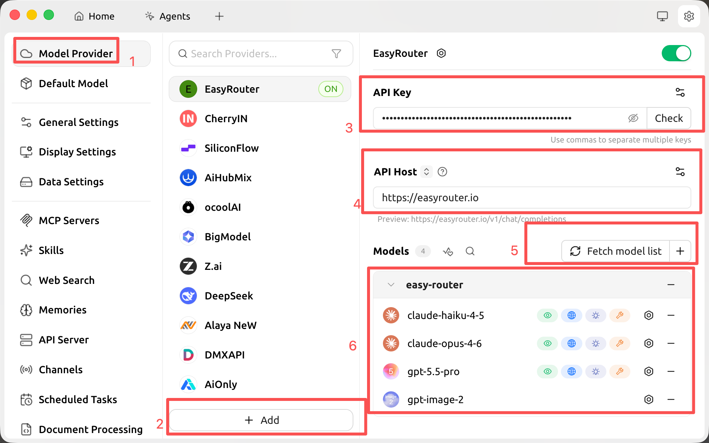
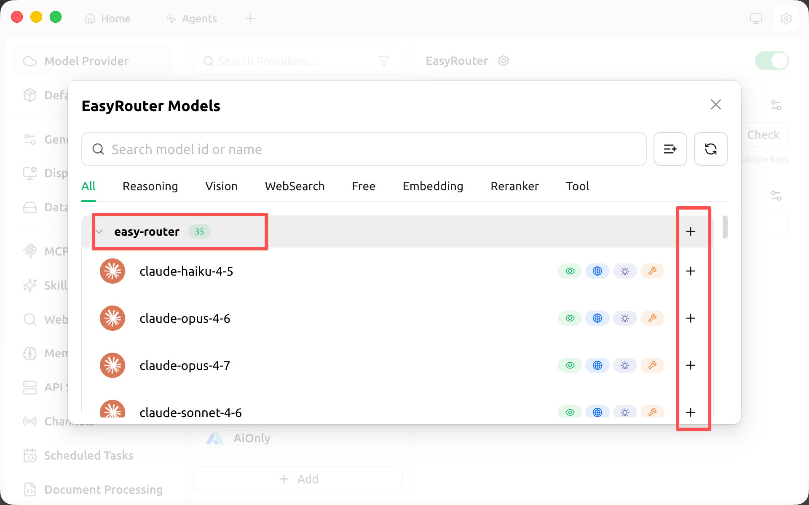
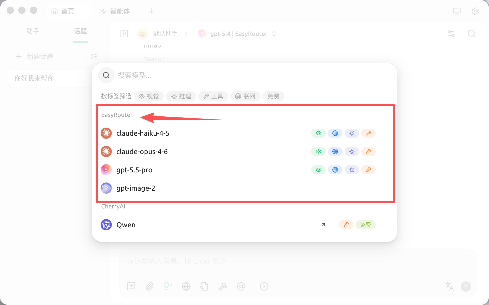

# Cherry Studio

> 本页以 OpenSand 的 API 地址、脚本地址和控制台字段为准；第三方客户端界面可能随版本变化，请以你当前安装版本为准。


**聊天设置选项**

在 OpenSand
控制台的系统设置->聊天设置中，可添加如下快捷选项，便于在令牌管理页一键填充到
Cherry Studio：

    ```json
    { "Cherry Studio": "cherrystudio://providers/api-keys?v=1&data={cherryConfig}" }
    ```

🍒 Cherry Studio 是一款功能强大的桌面 AI 客户端，专为专业用户设计，集成了 30+
行业智能助手，能够满足各种工作场景的需求，显著提升工作效率。

- 官网地址：[https://cherry-ai.com](https://cherry-ai.com/)
- 下载地址：[https://cherry-ai.com/download](https://cherry-ai.com/download)
- 官方文档：[https://docs.cherry-ai.com](https://docs.cherry-ai.com)

## OpenSand 接入方法

### 参数填写

提供商类型：OpenSand 支持的类型
API 密钥：于 OpenSand 获取
API 地址：OpenSand 站点地址

### 图文指引

1. 在 OpenSand 中复制 API key
   

2. 添加提供商
   

3. 添加模型
   

4. 返回聊天页面
   

5. 切换 OpenSand 模型
   
