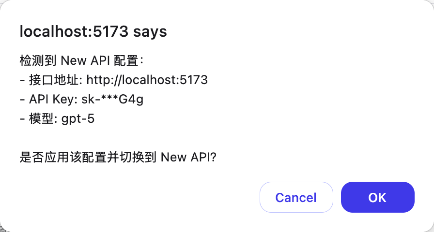
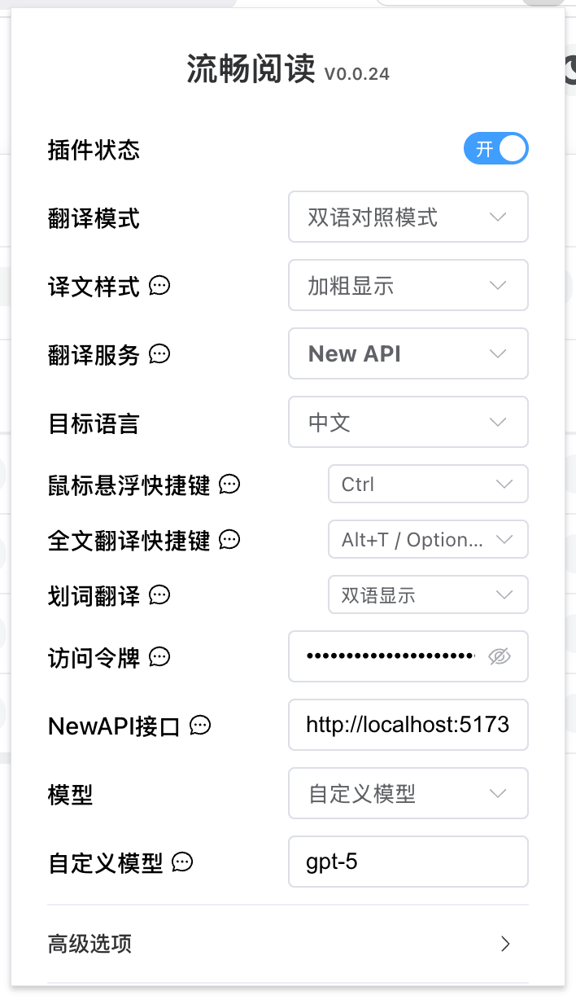
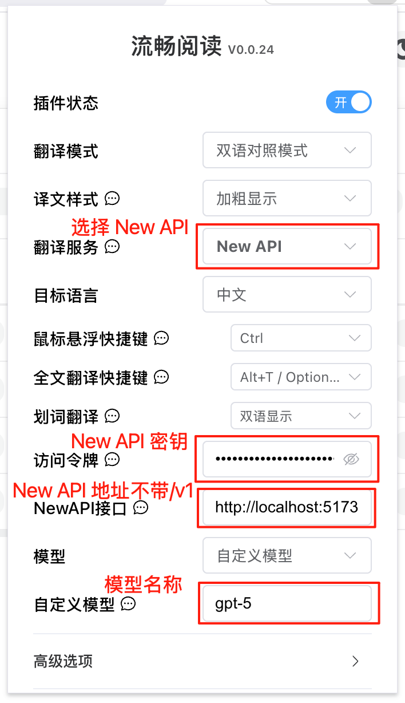

# 流畅阅读 (FluentRead) - 开源翻译插件

> 本页以 OpenSand 的 API 地址、脚本地址和控制台字段为准；第三方客户端界面可能随版本变化，请以你当前安装版本为准。


**聊天设置选项**

在 OpenSand
控制台的系统设置->聊天设置中，可添加如下快捷选项，便于在令牌管理页一键填充到
FluentRead：

    ```json
    { "流畅阅读": "fluentread" }
    ```

🌊
流畅阅读（FluentRead）是一款开源浏览器翻译插件，致力于提供母语般的阅读体验。

- 项目地址：[https://github.com/Bistutu/FluentRead](https://github.com/Bistutu/FluentRead)

## 🌟 核心特性

### 智能翻译引擎

- **多引擎支持**：支持 20+ 种翻译引擎
- **传统翻译**：微软翻译、谷歌翻译、DeepL翻译等
- **AI 大模型**：OpenAI、DeepSeek、Kimi、Ollama等
- **自定义引擎**：支持自定义翻译服务配置

### 沉浸式阅读体验

- **双语对照**：原文与译文并列显示，阅读更轻松
- **划词翻译**：选中任意文本，即时获得翻译结果
- **一键复制**：快速复制译文，提高阅读效率
- **全文翻译**：悬浮球一键翻译整个网页，无需刷新页面

### 隐私与定制

- **隐私保护**：所有数据本地存储，代码开源透明
- **高度定制**：丰富的自定义选项，满足不同场景需求
- **完全免费**：开源免费，非商业化项目

## 📦 安装方式

| 浏览器      | 安装方式                                                                                                                                                                                                                                      |
| ----------- | --------------------------------------------------------------------------------------------------------------------------------------------------------------------------------------------------------------------------------------------- |
| **Chrome**  | [Chrome 应用商店](https://chromewebstore.google.com/detail/%E6%B5%81%E7%95%85%E9%98%85%E8%AF%BB/djnlaiohfaaifbibleebjggkghlmcpcj?hl=zh-CN&authuser=0) \| [国内镜像](https://www.crxsoso.com/webstore/detail/djnlaiohfaaifbibleebjggkghlmcpcj) |
| **Edge**    | [Edge 应用商店](https://microsoftedge.microsoft.com/addons/detail/%E6%B5%81%E7%95%85%E9%98%85%E8%AF%BB/kakgmllfpjldjhcnkghpplmlbnmcoflp?hl=zh-CN)                                                                                             |
| **Firefox** | [Firefox 附加组件商店](https://addons.mozilla.org/zh-CN/firefox/addon/%E6%B5%81%E7%95%85%E9%98%85%E8%AF%BB/)                                                                                                                                  |

## 🚀 配置方法

### 从 OpenSand 控制台导入配置（推荐）

当浏览器安装了流畅阅读插件后，打开 OpenSand 控制台->令牌管理页面会弹出添加流畅阅读的提示


选择模型后点击一键填充到FluentRead，会弹出确认窗口，检查对应的信息是否正确



确认导入后在流畅阅读中的OpenSand配置便会启用



### 在流畅阅读中手动填写配置



| 配置项     | 内容                       |
| ---------- | -------------------------- |
| 翻译服务   | OpenSand                     |
| 访问令牌   | OpenSand 密钥                |
| OpenSand接口 | OpenSand部署地址（不带/v1）  |
| 模型       | 列表中选择，或者自定义模型 |
| 自定义模型 | 模型名称                   |
